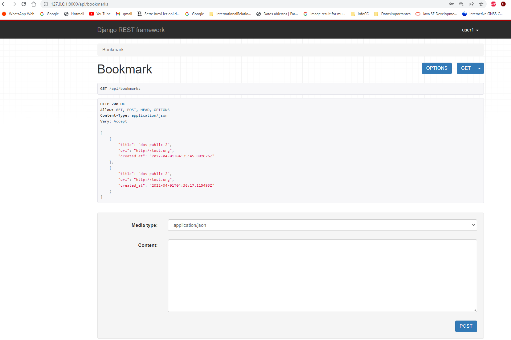
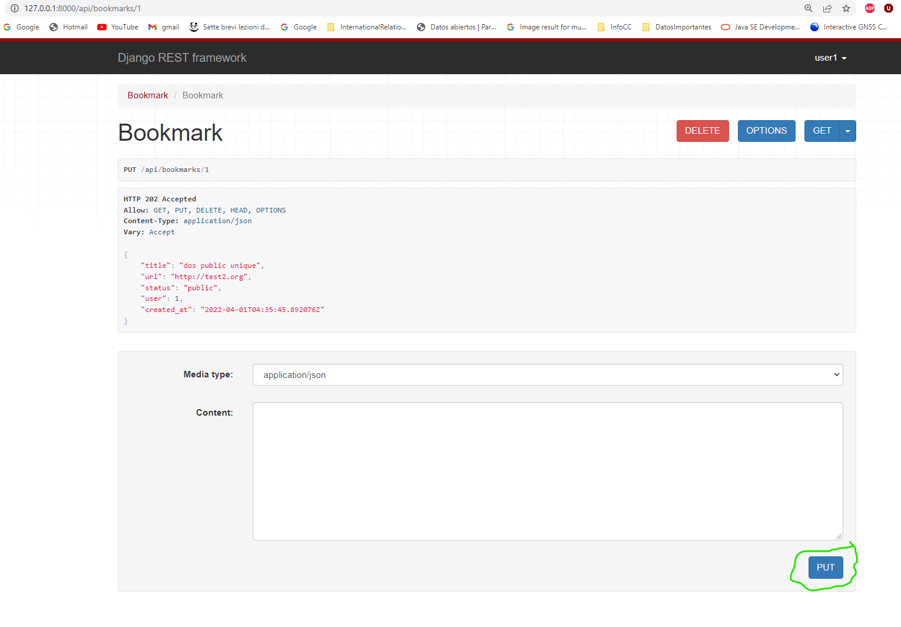

# Bookmarks Rest

This is a basis Rest for bookmaks
## SCREENSHOTS DJANGO REST FRAMEWORK

**post**



**PUT**

## TRY

For list bookmarks, run:

```bash
curl --request GET \
  --url http://localhost:8000/api/bookmarks
```

For create:

```bash
curl --request POST \
  --url http://localhost:8000/api/bookmarks \
  --header 'Authorization: Basic YWRtaW46YWRtaW4=' \
  --header 'Content-Type: application/json' \
  --data '{
	"title": "dos public 2",
  "url": "http://test.org",
  "status": "public",
	"user": 2
}'
```

For list only one:

```bash
curl --request GET \
  --url http://localhost:8000/api/bookmarks/1
```

For update: 

```bash
curl --request PUT \
  --url http://localhost:8000/api/bookmarks/1 \
  --header 'Content-Type: application/json' \
  --data '{
	"title": "Test",
  "url": "http://test.org",
  "status": "private"
}'
```

For delete:

```bash
curl --request DELETE \
  --url http://localhost:8000/api/bookmarks/2
```
